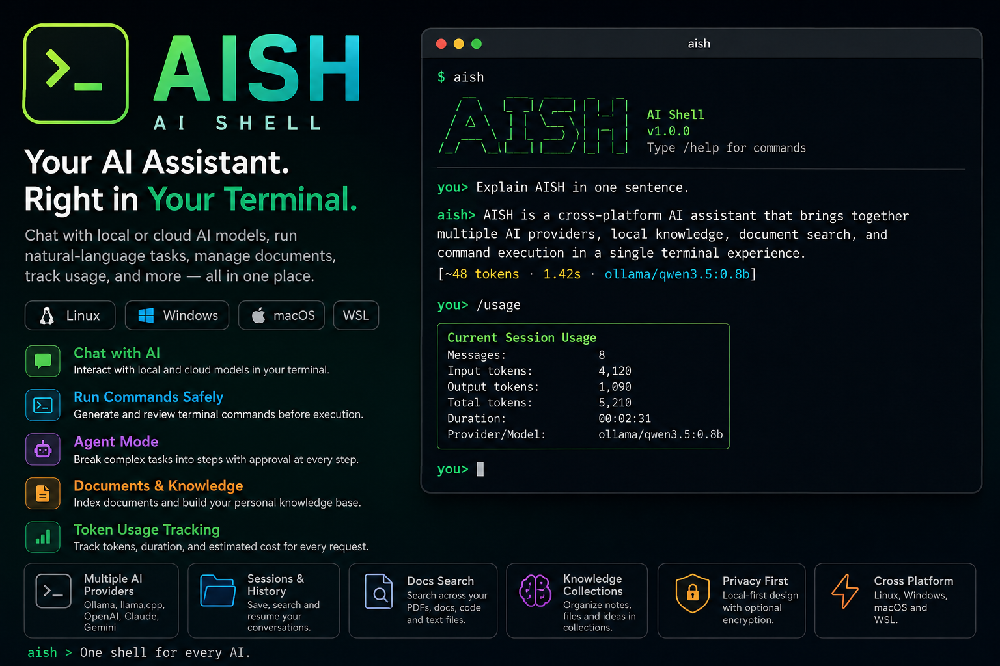

<p align="center">
  
</p>

# AISH — AI Shell

**One terminal. Multiple AI providers. Local knowledge. Safer command execution.**

AISH is a cross-platform AI assistant for Linux, Windows, macOS, and WSL.

It lets you chat with local or cloud AI models directly from your terminal, run natural-language tasks, manage local knowledge, search documents, track token usage, and switch between providers without changing tools.

AISH supports:

* Ollama
* llama.cpp
* OpenAI
* Anthropic Claude
* Google Gemini

AISH is designed for developers, terminal users, privacy-focused users, and anyone who wants one command-line interface for multiple AI providers.

---

## Why AISH?

AI tools are often separated across different applications, providers, APIs, and local model runtimes.

AISH brings them together in one terminal experience.

With AISH, you can:

* Use local models without an API key
* Switch between local and cloud providers
* Chat directly in the terminal
* Generate terminal commands from natural language
* Review commands before execution
* Create multi-step agent tasks
* Search local files using embeddings
* Organize personal knowledge into collections
* Save chat sessions and history
* Track token usage and request duration
* Run on Linux, Windows, macOS, and WSL

---

## Features

### Multiple AI providers

Switch between providers using one interface:

```bash
aish provider list
aish provider use ollama
aish provider use openai
aish provider use claude
aish provider use gemini
aish provider use llamacpp
```

Supported providers:

| Provider  | Local | API key required |
| --------- | ----: | ---------------: |
| Ollama    |   Yes |               No |
| llama.cpp |   Yes |               No |
| OpenAI    |    No |              Yes |
| Claude    |    No |              Yes |
| Gemini    |    No |              Yes |

---

### Interactive terminal chat

Start AISH:

```bash
aish
```

Then chat directly:

```text
you> Explain this project in one paragraph.

aish> AISH is a cross-platform AI shell that connects local and cloud AI providers, manages documents, runs approved commands, and tracks usage.
```

Useful interactive commands:

```text
/help
/status
/provider ollama
/model qwen3.5:0.8b
/history
/usage
/clear
/exit
```

---

### Ask a single question

```bash
aish ask "Explain Docker in one sentence."
```

Example:

```text
aish> Docker packages applications and their dependencies into portable containers that run consistently across environments.

[~48 tokens · 1.42s · ollama/qwen3.5:0.8b]
```

---

### Guided setup

Run:

```bash
aish setup
```

Example:

```text
AISH setup

Choose an AI provider:

  1) ollama
  2) llamacpp
  3) openai
  4) claude
  5) gemini

Provider number: 1
Model: qwen3.5:0.8b
Base URL: http://localhost:11434

Configuration saved.
```

---

### Configuration check

Use the doctor command to verify your setup:

```bash
aish doctor
```

Example:

```text
AISH doctor

[OK] Operating system: linux/amd64
[OK] Active provider: ollama
[OK] Model: qwen3.5:0.8b
[OK] Endpoint: http://localhost:11434
[OK] Connectivity: connected
[OK] Model found

AISH is ready.
```

---

## Ollama setup

Install and start Ollama, then pull a model:

```bash
ollama pull qwen3.5:0.8b
```

Configure AISH:

```bash
aish provider use ollama
aish config set model qwen3.5:0.8b
aish config set base-url http://localhost:11434
aish doctor
```

Ask a question:

```bash
aish ask "What is the difference between RAM and storage?"
```

---

## WSL with Ollama running on Windows

If AISH runs inside WSL and Ollama runs on Windows, find the Windows host IP:

```bash
ip route show | awk '/default/ {print $3}'
```

Then configure AISH:

```bash
aish config set base-url http://172.22.160.1:11434
aish config set model qwen3.5:0.8b
aish doctor
```

The IP may change after restarting WSL.

---

## Natural-language command execution

Use `aish do` to generate a terminal command from natural language:

```bash
aish do "show the five largest files in this folder"
```

Example:

```text
Proposed command:

find . -maxdepth 1 -type f -printf '%s\t%p\n' | sort -nr | head -n 5

Reason:
Find the five largest files in the current directory.

Run this command? [y/N]:
```

AISH does not run generated commands automatically. You must review and approve them first.

---

## Agent mode

Agent mode breaks a task into multiple steps:

```bash
aish agent "inspect this Go project, run the tests, and summarize any failures"
```

Example plan:

```text
Agent task:
Inspect this Go project, run the tests, and summarize any failures.

Plan:

1. Check the Go version
2. Inspect the current module
3. Check Git status
4. Run tests
5. Run static checks
6. Summarize the result
```

For every step, you can choose:

```text
[y]es
[s]kip
[p]ause
[c]ancel
```

Manage agent tasks:

```bash
aish agent list
aish agent show 1
aish agent resume 1
aish agent delete 1
```

Agent tasks are stored locally and can be resumed later.

---

## Chat sessions and history

Start a named session:

```bash
aish chat --session my-project
```

List sessions:

```bash
aish session list
```

Open a saved session:

```bash
aish session open my-project
```

Delete a session:

```bash
aish session delete my-project
```

View history:

```bash
aish history
```

---

## Local documents

AISH can index local files and use them as context.

Supported formats include:

```text
.txt
.md
.json
.csv
.yaml
.yml
.toml
.go
.py
.js
.ts
.rs
.java
.c
.cpp
.h
.html
.css
.xml
.log
.docx
.pdf
```

For PDF support on Linux:

```bash
sudo apt install poppler-utils
```

Pull an embedding model:

```bash
ollama pull nomic-embed-text
```

Add documents:

```bash
aish docs add ./documents
```

List indexed documents:

```bash
aish docs list
```

Search documents:

```bash
aish docs search "installation instructions"
```

Ask a question using document context:

```bash
aish docs ask "How do I install this project?"
```

Remove one file:

```bash
aish docs remove ./documents/guide.md
```

Remove all indexed documents from a folder:

```bash
aish docs remove ./documents
```

Clear the complete document index:

```bash
aish docs clear
```

Removing indexed documents does not delete the original files.

---

## Personal knowledge collections

Knowledge collections let you organize long-term information.

Create collections:

```bash
aish knowledge create personal
aish knowledge create work
aish knowledge create study
```

List collections:

```bash
aish knowledge list
```

Select one:

```bash
aish knowledge use personal
```

Add files or folders:

```bash
aish knowledge add ~/Documents
```

Add content to a specific collection:

```bash
aish knowledge add work ./project-docs
```

Search:

```bash
aish knowledge search "insurance renewal"
```

Ask questions:

```bash
aish knowledge ask "When does my insurance renew?"
```

AISH includes source paths in knowledge answers when relevant:

```text
Your insurance renews in September.

[source: /home/user/Documents/insurance-policy.pdf]
```

Watch a folder for changes:

```bash
aish knowledge watch ~/Documents/notes
```

Remove indexed content:

```bash
aish knowledge remove ~/Documents/old-note.md
```

Clear a collection:

```bash
aish knowledge clear personal
```

Delete a collection:

```bash
aish knowledge delete study
```

---

## Token usage tracking

AISH tracks token usage for requests, sessions, and agent tasks.

After a request:

```text
[~1,558 tokens · 2.80s · ollama/qwen3.5:0.8b]
```

The `~` symbol means the token count is estimated.

Detailed display:

```bash
aish config set show-usage always
```

Compact display:

```bash
aish config set show-usage summary
```

Disable display:

```bash
aish config set show-usage off
```

View all usage:

```bash
aish usage
```

View today’s usage:

```bash
aish usage today
```

View usage for a session:

```bash
aish usage session my-project
```

View usage for an agent task:

```bash
aish usage task 1
```

Export usage:

```bash
aish usage export --format json
aish usage export --format csv --output usage.csv
```

Clear usage records:

```bash
aish usage reset
```

---

## Optional cost estimation

AISH can estimate API cost when pricing is configured.

Set input and output prices per one million tokens:

```bash
aish pricing set input 0.15
aish pricing set output 0.60
```

View current pricing:

```bash
aish pricing show
```

Example:

```text
Input tokens:  8,420
Output tokens: 1,930
Estimated cost: $0.002421
```

Local models have no API cost by default.

---

## Encrypted local storage

AISH can encrypt local history, usage records, sessions, knowledge collections, agent tasks, and indexes.

Set an encryption passphrase:

```bash
export AISH_ENCRYPTION_KEY="your-long-private-passphrase"
```

Check privacy status:

```bash
aish privacy
```

Example:

```text
AISH privacy

Provider: ollama
Processing: local endpoint
History/index encryption: enabled
Telemetry: none
```

Do not lose your encryption key. Encrypted files cannot be recovered without it.

---

## Installation

### Linux

```bash
curl -fsSL https://raw.githubusercontent.com/khashino/AISH/main/scripts/install.sh | sh
```

Make sure the install directory is in your PATH:

```bash
export PATH="$HOME/.local/bin:$PATH"
```

Then:

```bash
aish setup
```

---

### Windows PowerShell

```powershell
irm https://raw.githubusercontent.com/khashino/AISH/main/scripts/install.ps1 | iex
```

Open a new PowerShell window:

```powershell
aish setup
aish doctor
```

---

### macOS

Apple Silicon:

```bash
chmod +x aish-v1.0.0-darwin-arm64
sudo mv aish-v1.0.0-darwin-arm64 /usr/local/bin/aish
```

Intel:

```bash
chmod +x aish-v1.0.0-darwin-amd64
sudo mv aish-v1.0.0-darwin-amd64 /usr/local/bin/aish
```

If macOS blocks the unsigned binary:

```bash
xattr -d com.apple.quarantine /usr/local/bin/aish
```

Then:

```bash
aish setup
```

---

## Manual installation

Download the correct release binary:

```text
aish-v1.0.0-linux-amd64
aish-v1.0.0-windows-amd64.exe
aish-v1.0.0-darwin-amd64
aish-v1.0.0-darwin-arm64
```

Linux example:

```bash
chmod +x aish-v1.0.0-linux-amd64
sudo mv aish-v1.0.0-linux-amd64 /usr/local/bin/aish
```

Verify:

```bash
aish version
```

---

## API keys

Cloud providers require environment variables.

Linux and macOS:

```bash
export OPENAI_API_KEY="your-key"
export ANTHROPIC_API_KEY="your-key"
export GEMINI_API_KEY="your-key"
```

Windows PowerShell:

```powershell
$env:OPENAI_API_KEY="your-key"
$env:ANTHROPIC_API_KEY="your-key"
$env:GEMINI_API_KEY="your-key"
```

Never commit API keys to GitHub.

---

## Main commands

```text
aish
aish ask
aish setup
aish doctor
aish config
aish provider
aish history
aish session
aish run
aish do
aish agent
aish project
aish docs
aish knowledge
aish usage
aish pricing
aish privacy
aish update
aish version
```

Run:

```bash
aish help
```

for the complete command list.

---

## Build from source

Requirements:

* Go 1.22 or newer

Clone:

```bash
git clone https://github.com/khashino/AISH.git
cd AISH
```

Run tests:

```bash
go test ./...
go vet ./...
```

Build:

```bash
go build -o aish ./cmd/aish
```

Run:

```bash
./aish version
```

Cross-compile:

```bash
GOOS=linux GOARCH=amd64 go build -o aish-linux-amd64 ./cmd/aish
GOOS=windows GOARCH=amd64 go build -o aish-windows-amd64.exe ./cmd/aish
GOOS=darwin GOARCH=amd64 go build -o aish-darwin-amd64 ./cmd/aish
GOOS=darwin GOARCH=arm64 go build -o aish-darwin-arm64 ./cmd/aish
```

---

## Safety

AISH can generate and execute terminal commands.

Always review commands before approving them.

AISH includes command validation, approval prompts, retry limits, and basic dangerous-command protection, but it is not a complete operating-system sandbox.

Be especially careful with commands involving:

```text
sudo
rm
chmod
chown
disk formatting
network configuration
system services
credentials
SSH keys
```

---

## Privacy

AISH does not include telemetry.

When using local providers such as Ollama or llama.cpp:

* Prompts are processed locally
* Documents remain on your machine
* No API key is required

When using cloud providers:

* Prompts are sent to the selected provider
* Provider privacy policies apply

Use:

```bash
aish privacy
```

to inspect the active configuration.

---

## Project status

AISH v1.0 is the first stable public release.

The project is actively improving, and bug reports, feature requests, documentation improvements, and pull requests are welcome.

---

## Contributing

1. Fork the repository
2. Create a branch
3. Make your changes
4. Run tests
5. Open a pull request

```bash
git checkout -b feature/my-feature
go test ./...
git commit -m "Add my feature"
git push origin feature/my-feature
```

---

## Feedback

Open an issue for:

* Bugs
* Installation problems
* Provider compatibility
* Feature requests
* Documentation improvements
* Security concerns

GitHub:

https://github.com/khashino/AISH

---

## License

AISH is available under the MIT License.

---

## Acknowledgements

AISH is built for the open-source AI ecosystem and works with projects and providers including Ollama, llama.cpp, OpenAI, Anthropic Claude, and Google Gemini.

---

**AISH — one shell for every AI.**
